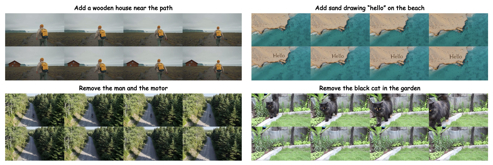

<div align="center">

  <h1>
    NOVA: Sparse Control, Dense Synthesis for Pair-Free Video Editing
  </h1>
  
  <h3>CVPR 2026</h3>
  
  [](https://arxiv.org/abs/2603.02802) [](https://huggingface.co/ldiex/NovaEdit)
</div>


## 🏗️ Architecture Note

The paper describes a WAN VACE 1.3B-based design with a dedicated sparse VACE branch, a copied dense DiT branch, and trainable cross-attention (CA) modules connecting them. The current codebase simplifies this to a single **WAN 1.3B Fun InP** model where source, cue (keyframe), and target latents are concatenated along the temporal axis, with RoPE used to distinguish their roles. Reasons for the change:

- **Better color consistency**: VACE pre-trained weights introduced color artifacts
- **Better structural edit support**: ControlNet-style conditioning is too rigid for edits with large structural changes
- **Simpler single-keyframe support**: the new design naturally degrades to standard image-to-video when only one keyframe is provided
- **Optional coarse mask**: a rough rectangular mask of the edit region can be supplied to improve editing accuracy (not required, and does not need to be precise)

Despite the arch simplification, our **pair-free training via degradation simulation** with sparse keyframe control and dense source video synthesis remains unchanged from the paper.

## 📦 Installation

[uv](https://docs.astral.sh/uv/) is a fast Python package manager. Install it first, then set up the project:

```bash
uv init --python 3.12
uv venv

# Activate virtual environment (bash/zsh)
source .venv/bin/activate
# Or for fish shell:
# source .venv/bin/activate.fish

# Install dependencies
uv add -r requirements.txt
```

Or if you prefer pip:

```bash
pip install -r requirements.txt
```

## 📥 Model Download

Download the required pre-trained models:

```bash
python download_wan2.1.py
```

---

## 🎮 Gradio Demo

A web-based interactive demo for video editing using NOVA.

https://github.com/user-attachments/assets/dbde0eb4-58bc-4491-9b31-5a981e15ae16

### 🖥️ System Requirements
We recommend using a machine with at least 80GB VRAM for smooth operation.

24GB VRAM machines can also run the demo, but you may need to mannually offload the model for SAM2 and FLUX.1 Kontext during inference in `gradio_demo/demo.py`.

### ⚙️ Configuration

Before launching the demo, configure the model paths in `gradio_demo/demo.py`:

**1. Flux Model Path**:
```python
FLUX_MODEL_PATH = "/path/to/flux-kontext"
```

**2. Nova Pipeline Paths**:
```python
CKPT_PATH = "/path/to/nova/checkpoints"
MODEL_PATH = "/path/to/wan/models"
TARGET_STEP = 252  # Set your checkpoint step
```

**Required Models:**
- Flux-Kontext model for image editing
- Wan 2.1 models (text encoder, image encoder, VAE, DiT)
- Trained Nova checkpoint (stepXXX.ckpt)

### 🚀 Launch the Demo

```bash
cd gradio_demo
python demo.py
```

The demo will start at `http://0.0.0.0:8081`

### 📋 Usage Workflow

1. **Upload Video**: Upload a source video (at least 81 frames)
2. **Extract First Frame**: Click to extract the first frame for segmentation
3. **Segment Object**: Click on the first frame to mark the target object
   - Use **Positive** clicks for object areas
   - Use **Negative** clicks to refine boundaries
4. **Save BBox**: Export the bounding box image for editing
5. **Image Edit (Flux)**: Enter a prompt to edit the bounding box image (or you can edit it manually, and upload the edited image)
6. **Start Tracking**: Track the segmented object through the video
7. **Run Nova Inference**: Generate the final edited video

---
## 📁 Dataset Format
### 🎬 Create Keyframes Videos
We assume all the videos for training and inference are 81 frames long.

For the keyframes video:
  - In training, extract the 0, 10, 20, 30, 40, 50, 60, 70, 80 frames from the source video to create the keyframes video. You can left the remaining frames black or blank.
  - In inference, you can set the 0 frame as the edited first frame via a image editing model. The 10, 20, 30, 40, 50, 60, 70, 80 frames can be also set as the edited frames from the source video (optional), and the remaining frames can be left black or blank.

### 📊 Training Dataset

Create a CSV file (e.g., `metadata.csv`) with the following columns:

```csv
video,prompt,vace_video,src_video
./gt/vid_00000.mp4,"",./keyframes/vid_00000.mp4,./masked/vid_00000.mp4
./gt/vid_00001.mp4,"",./keyframes/vid_00001.mp4,./masked/vid_00001.mp4
./gt/vid_00002.mp4,"",./keyframes/vid_00002.mp4,./masked/vid_00002.mp4
```

**Column descriptions:**
- `video`: Path to the ground truth target video
- `prompt`: Text prompt for generation (can be empty string)
- `vace_video`: Path to the VACE/cue frames video
- `src_video`: Path to the source/masked video

**Directory structure:**
```
dataset_path/
├── metadata.csv
├── gt/
│   ├── vid_00000.mp4
│   ├── vid_00001.mp4
│   └── ...
├── keyframes/
│   ├── vid_00000.mp4
│   ├── vid_00001.mp4
│   └── ...
└── masked/
    ├── vid_00000.mp4
    ├── vid_00001.mp4
    └── ...
```

### 🚀 Inference Dataset

Create a CSV file (e.g., `metadata.csv`) with the following columns:

```csv
prompt,vace_video,src_video
"",./keyframes/vid_00000.mp4,./masked/vid_00000.mp4
"",./keyframes/vid_00001.mp4,./masked/vid_00001.mp4
"",./keyframes/vid_00002.mp4,./masked/vid_00002.mp4
```

**📝 Note:** There is an example in `./example_videos/metadata.csv` for inference.

---
## 🚀 Inference in CLI

### 💻 Single GPU Inference

```bash
python infer_nova.py \
  --dataset_path ./example_videos \
  --metadata_file_name metadata.csv \
  --ckpt_path /path/to/checkpoints/stepXXX.ckpt \
  --output_path ./inference_results \
  --text_encoder_path /path/to/models_t5_umt5-xxl-enc-bf16.pth \
  --image_encoder_path /path/to/models_clip_open-clip-xlm-roberta-large-vit-huge-14.pth \
  --vae_path /path/to/Wan2.1_VAE.pth \
  --dit_path /path/to/diffusion_pytorch_model.safetensors \
  --num_samples 5 \
  --num_inference_steps 50 \
  --num_frames 81 \
  --height 480 \
  --width 832 \
  --first_only
```

**🔑 Key arguments:**
- `--ckpt_path`: Path to trained checkpoint
- `--num_samples`: Number of samples to generate
- `--num_inference_steps`: Denoising steps (default 50)
- `--first_only`: Use only the first cue frame for all cue positions, **if you have set multiple cue frames in the keyframes video, just omit this flag**
- `--tiled`: Enable VAE tiling for GPU memory savings

### 🖥️ Multi-GPU Inference

```bash
CUDA_VISIBLE_DEVICES=0,1,2,3 python infer_rank.py \
  --rank 0 \
  --world_size 4 \
  --dataset_path /path/to/your/dataset \
  --metadata_file_name metadata.csv \
  --ckpt_path /path/to/checkpoints/stepXXX.ckpt \
  --output_path ./inference_results \
  --text_encoder_path /path/to/models_t5_umt5-xxl-enc-bf16.pth \
  --image_encoder_path /path/to/models_clip_open-clip-xlm-roberta-large-vit-huge-14.pth \
  --vae_path /path/to/Wan2.1_VAE.pth \
  --dit_path /path/to/diffusion_pytorch_model.safetensors \
  --num_samples 10 \
  --num_frames 81 \
  --height 480 \
  --width 832
```

---
## 🏋️ Training

### 1️⃣ Data Processing

First, preprocess the dataset and encode videos to latents:

```bash
python train_nova.py \
  --task data_process \
  --dataset_path /path/to/your/dataset \
  --metadata_file_name metadata.csv \
  --batch_size 4 \
  --text_encoder_path /path/to/models_t5_umt5-xxl-enc-bf16.pth \
  --image_encoder_path /path/to/models_clip_open-clip-xlm-roberta-large-vit-huge-14.pth \
  --vae_path /path/to/Wan2.1_VAE.pth \
  --dit_path /path/to/diffusion_pytorch_model.safetensors \
  --num_frames 81 \
  --height 480 \
  --width 832
```

### 2️⃣ Training

After data processing, start training:

```bash
python train_nova.py \
  --task train \
  --dataset_path /path/to/your/dataset \
  --metadata_file_name metadata.csv \
  --output_path /path/to/save/checkpoints \
  --batch_size 3 \
  --dit_path /path/to/diffusion_pytorch_model.safetensors \
  --learning_rate 5e-5 \
  --max_epochs 500 \
  --steps_per_epoch 2000 \
  --use_gradient_checkpointing
```

**🔑 Key arguments:**
- `--dataset_path`: Path to your dataset directory
- `--output_path`: Directory to save checkpoints
- `--batch_size`: Batch size (adjust based on GPU memory)
- `--learning_rate`: Default 1e-5
- `--max_epochs`: Number of training epochs
- `--steps_per_epoch`: Steps per epoch
- `--resume_ckpt_path`: Resume from checkpoint (optional)

---
## 📂 Model Paths

The following placeholders should be replaced with actual paths to pre-trained models:

| Placeholder | Description |
|-------------|-------------|
| `text_encoder_path` | Text encoder model (models_t5_umt5-xxl-enc-bf16.pth) |
| `image_encoder_path` | Image encoder model (models_clip_open-clip-xlm-roberta-large-vit-huge-14.pth) |
| `vae_path` | VAE model (Wan2.1_VAE.pth) |
| `dit_path` | DiT model (diffusion_pytorch_model.safetensors) |
| `ckpt_path` | Trained checkpoint (stepXXX.ckpt) |

## 💾 Output

Inference results are saved to:
- Combined comparison: `{output_path}/{name}_epoch{epoch_idx}.mp4`
- Individual results: `{output_path}/results/{name}_epoch{epoch_idx}.mp4`

---

## 🙏 Acknowledgements

We thank the following repos for their contributions:
- [KlingTeam/ReCamMaster](https://github.com/KlingTeam/ReCamMaster) for the training framework
- [zibojia/MiniMax-Remover](https://github.com/zibojia/MiniMax-Remover) for their gradio demo template
